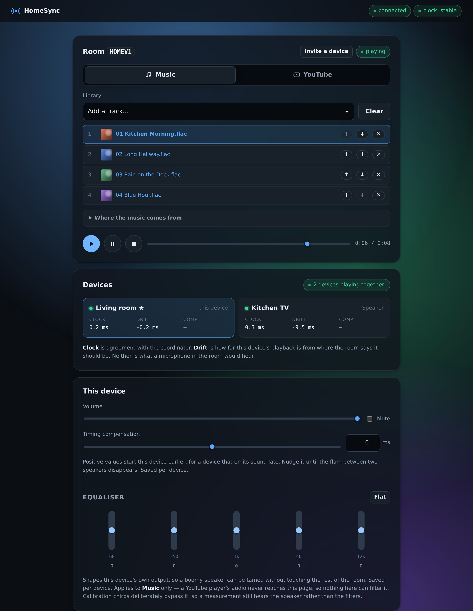
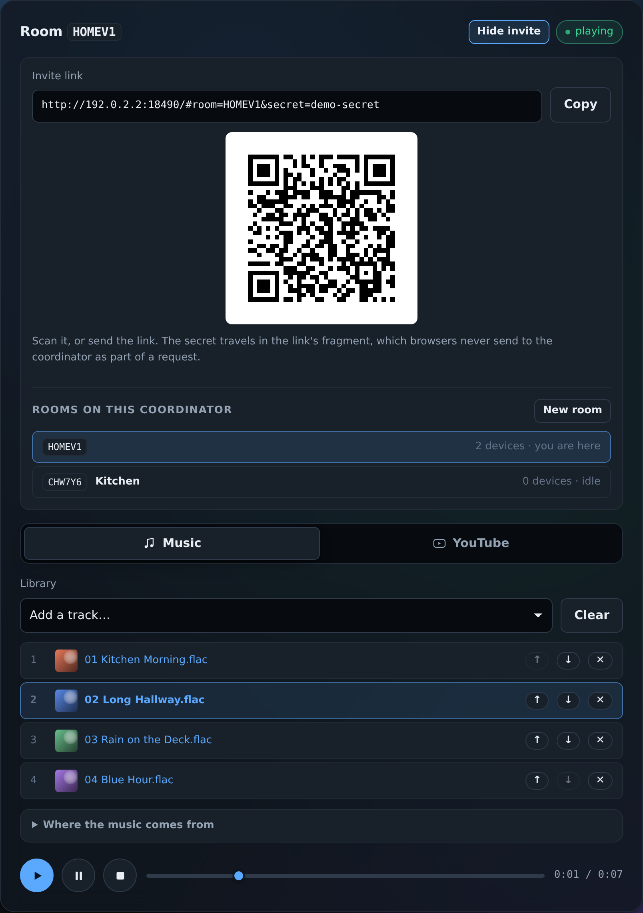
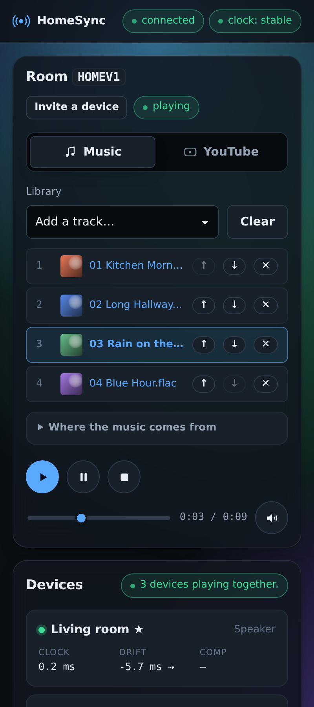
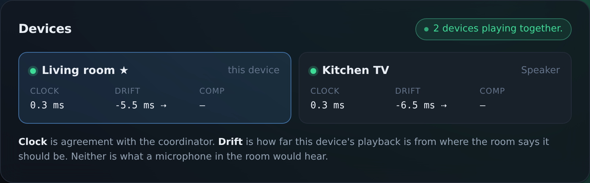
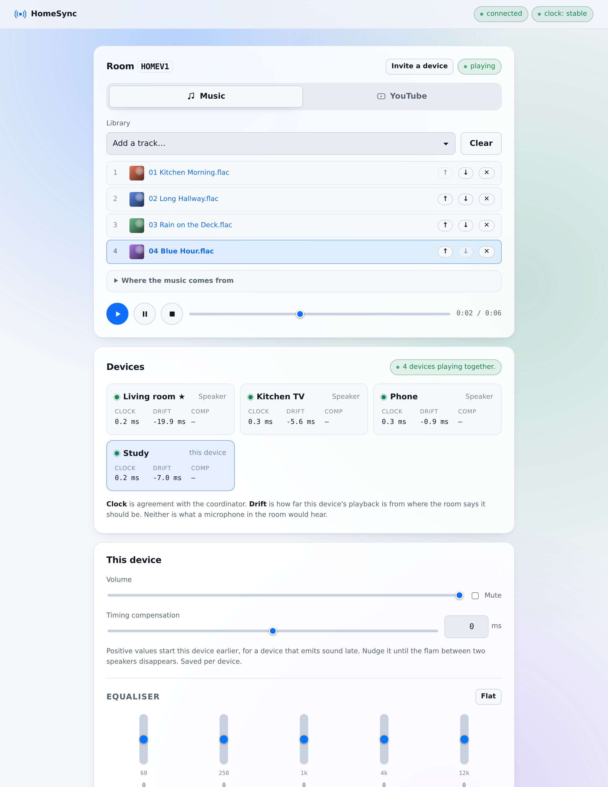

```
██╗  ██╗ ██████╗ ███╗   ███╗███████╗███████╗██╗   ██╗███╗   ██╗ ██████╗
██║  ██║██╔═══██╗████╗ ████║██╔════╝██╔════╝╚██╗ ██╔╝████╗  ██║██╔════╝
███████║██║   ██║██╔████╔██║█████╗  ███████╗ ╚████╔╝ ██╔██╗ ██║██║
██╔══██║██║   ██║██║╚██╔╝██║██╔══╝  ╚════██║  ╚██╔╝  ██║╚██╗██║██║
██║  ██║╚██████╔╝██║ ╚═╝ ██║███████╗███████║   ██║   ██║ ╚████║╚██████╗
╚═╝  ╚═╝ ╚═════╝ ╚═╝     ╚═╝╚══════╝╚══════╝   ╚═╝   ╚═╝  ╚═══╝ ╚═════╝
```

<div align="center">

**Play the same music, in time, on every device in your house.**

One Rust binary. No accounts, no cloud, no app to install —
every device joins from its browser.

[](LICENSE)
[](https://www.rust-lang.org)

</div>

<p align="center">
  
</p>

---

## What it is

Put a laptop, a phone and a TV in the same room and press play on all three, and
you get an echo. The devices do not share a clock, their audio hardware adds
different amounts of delay, and nothing tells them when "now" is.

HomeSync is a coordinator that fixes that. It measures every device's clock
against its own, works out how far each one drifts, and then schedules audio to
be **heard** at one agreed instant rather than merely *started* at roughly the
same time.

You run it on one machine on your network. Everything else joins by opening a
link.

- 🎵 **Music** — every device downloads the same file, verifies it, and plays it off one shared timeline
- 📺 **YouTube together** — every device runs its own player; HomeSync keeps them lined up
- 🎚️ **Per-device equaliser** — tame the boomy speaker in the kitchen without touching the rest
- 📶 **No internet needed** — it is your LAN, your files, your machine
- 🎛️ **Quiet drift correction** — a device whose clock runs fast is nudged back by a fraction of a percent instead of restarting the room
- 🚪 **Several rooms** — the kitchen plays one thing while the bedroom plays another, from one coordinator
- 🔍 **It tells you the truth** — one line saying whether the room is actually together, or which device is 2.4 s behind

## Quick start

You need [Rust](https://rustup.rs) (stable). Then:

```sh
git clone https://github.com/lewisjohnvillamor/homesync.git
cd homesync
cargo run --release
```

That is the whole install. The coordinator prints a LAN address, a room code, an
invite link and a QR code:

```text
  HomeSync coordinator 0.1.0 — protocol v1
  ---------------------------------------------
  Open on the LAN      : http://192.168.1.50:8080
  Open on this machine : http://localhost:8080
  Also try             : http://homesync.local:8080
  Room code            : K7M2QX
  Invite link          : http://192.168.1.50:8080/#room=K7M2QX&secret=01K...
```

Open the invite link on two devices, press **Enable audio & join** on each, pick
**Click track (built-in, 60 s)**, and press **Play**. A click track is used for
the first test on purpose — two clicks that are out of time are obvious in a way
that two songs are not.

To play your own music, point it at a folder:

```sh
cargo run --release -- --media-dir ~/Music
```

## Screenshots

| Invite a device, and run more than one room | The room, on a phone |
| --- | --- |
|  |  |

The invite panel is also where a second room comes from — the list shows every
room on the coordinator, which one you are in, and whether anything is playing
in the others.

**Is the room actually together?** The Devices panel answers in one line, and
names the device when it isn't:

<p align="center">
  
</p>

It follows your system theme:

<p align="center">
  
</p>

## Running the self-hosted server

### Prerequisites

| | |
| --- | --- |
| **Rust** | Stable, via [rustup](https://rustup.rs). Nothing else — no Node, no bundler, no database. The web client is compiled into the binary. |
| **Linux** | Nothing extra for the coordinator. |
| **macOS** | Nothing extra. |
| **Windows** | Nothing extra. Live system-audio capture additionally needs the MSVC toolchain, and is unverified — see [Status](#status). |

### Build a release binary

```sh
cargo build --release
./target/release/homesync --media-dir ~/Music
```

The binary is self-contained; copy it wherever you like. It needs no files
beside it except the ones it writes itself (certificate, device profiles).

### Common setups

```sh
# Point at several folders, including a mounted drive
cargo run --release -- --media-dir ~/Music --media-dir /mnt/nas/albums

# A fixed room code, so a saved invite link keeps working
cargo run --release -- --room-code HOUSE1

# HTTPS — required for acoustic calibration (see below)
cargo run --release -- --tls --media-dir ~/Music

# Keep it on this machine only
cargo run --release -- --bind 127.0.0.1
```

Folders can also be added from the interface while it is running, so a drive
plugged in later does not need a restart — restarting would drop every device
out of the room and lose their clocks.

### Useful flags

| Flag | Default | What it does |
| --- | --- | --- |
| `--media-dir <DIR>` | `media` | A folder to scan. Repeat for several. |
| `--port <PORT>` | `8080` | Listening port. |
| `--bind <ADDR>` | `0.0.0.0` | `127.0.0.1` keeps it off the network. |
| `--tls` | off | HTTPS with a self-signed certificate. Needed for calibration. |
| `--room-code <CODE>` | random | Fix the room code across restarts. |
| `--mdns <BOOL>` | `true` | Advertise `homesync.local`. |
| `--max-clients <N>` | `16` | Devices allowed in each room. |
| `--state-file <PATH>` | `homesync-devices.json` | Where per-device compensation is saved. |
| `--start-lead-ms <MS>` | `2000` | How far ahead playback is scheduled. |

`homesync --help` lists them all. Every flag has an `HOMESYNC_*` environment
variable, which is what you want under systemd or Docker.

### Run it as a service

<details>
<summary><b>systemd (Linux)</b></summary>

```ini
# /etc/systemd/system/homesync.service
[Unit]
Description=HomeSync coordinator
After=network-online.target

[Service]
ExecStart=/usr/local/bin/homesync
Environment=HOMESYNC_MEDIA_DIR=/srv/music
Environment=HOMESYNC_ROOM_CODE=HOUSE1
WorkingDirectory=/var/lib/homesync
Restart=on-failure
User=homesync

[Install]
WantedBy=multi-user.target
```

```sh
sudo systemctl enable --now homesync
```

`WorkingDirectory` matters: the certificate and the device profiles are written
there.
</details>

<details>
<summary><b>Windows</b></summary>

Run it from a terminal, or register it with
[NSSM](https://nssm.cc) to start with the machine. Windows Defender Firewall
will ask once for permission to accept connections — say yes for **private
networks**, or no device will be able to reach it.
</details>

### Which file formats work

`wav`, `mp3`, `m4a`, `m4b`, `mp4`, `aac`, `ogg`, `oga`, `opus`, `flac`, `webm`,
`aif` and `aiff`, with embedded cover art from FLAC, MP3 and MP4 files.

MP3, WAV, FLAC, Ogg Vorbis and Opus are **confirmed playing** — real encoded
files, selected in the interface and played, not fixtures. AAC in an `.m4a` is
the one to know about: it works on Chrome, Edge and Safari, and fails on an
open-source Chromium build, which ships without the licensed decoder. That is
the browser's limitation rather than HomeSync's, and when it happens the
interface names the file instead of leaving the room waiting for a device that
will never be ready. Measurements are in
[`docs/compatibility.md`](docs/compatibility.md).

`wma`, `ape`, `wv` and `dsf` are deliberately **not** listed, because no browser
decodes them — and a track in the queue that cannot play stops the room, which is
worse than not offering it. If a file will not decode, the interface says so and
names it.

### A track from a URL

Paste a link and the coordinator downloads it once, then serves it like any local
file, so the remote host is asked for it once instead of once per device. Endless
radio streams are refused: Music mode needs a file with a length and a hash to
schedule, and a stream has neither.

Only public URLs. Addresses on your own machine or network are refused on
purpose — see [`SECURITY.md`](SECURITY.md).

## Using it

### Getting devices in

Press **Invite a device** for a QR code and a copyable link. Scan it with a
phone, or send the link. The secret lives in the URL fragment, which browsers
never put on the wire.

Some devices need help finding the coordinator:

- **Android does not resolve `.local` names.** Give phones the IP address.
- **iPhone and iPad** need an explicit tap before any audio plays, so **Enable
  audio & join** is a real button rather than a formality.
- **A device on a guest network or a VPN** is not on your LAN and cannot reach
  the coordinator at all.

### More than one room

Open **Invite a device** and press **New room**. You get a second room with its
own code, secret and invite link — send that link to the devices that belong in
it. The kitchen can then play one thing while the bedroom plays another, from
the same coordinator, sharing its clock service and its library and nothing
else.

Creating a room does not move the device that created it, because whoever
presses the button is usually setting a room up for other devices, and being
yanked out of what you are listening to is not what that button looks like it
does.

Rooms survive a restart. Empty ones are dropped after half an hour, so a house
does not accumulate abandoned rooms; the room printed in the startup banner is
never dropped.

### Getting them in time

Four things are worth knowing, in order of how often they matter. The third one
happens on its own.

1. **Wait for the clocks.** A device that just joined has not measured its clock
   yet. Press Play anyway and HomeSync holds the start until every device is
   ready, telling you what it is waiting for. There is a force option when you
   would rather have sound now than sound in time.
2. **Nudge by ear.** If one speaker is audibly late, raise its **Timing
   compensation** until the flam disappears. It is saved per device and comes
   back when that device rejoins. This handles Bluetooth speakers, soundbars and
   televisions, whose latency the browser reports wrongly or not at all.
3. **Slow drift handles itself.** A device whose audio clock runs slightly fast
   or slow has its playback rate trimmed by a fraction of a percent until it is
   back in position — inaudible, and no interruption. You can see it happening:
   a device being corrected shows an arrow beside its drift figure. Only a
   device more than a quarter-second out gets the old, audible treatment of a
   coordinated restart.
4. **Or measure it.** Acoustic calibration plays coded chirps and has one device
   listen, working out each speaker's real delay rather than the one it claims.
   This needs `--tls`, because browsers refuse microphone access on a plain-HTTP
   address. It has never been run against a real microphone — see
   [Status](#status).

### Playing to a TV

Open the invite link in the television's browser like any other device. Before
trusting it, open **`/probe.html`** on it: that page reports whether the device's
audio clock runs at the right rate, which is the difference between a receiver
that can hold a schedule and one that cannot.

What a TV *cannot* do is share audio from Netflix, YouTube or Spotify running as
their own apps. That is an operating-system boundary, not something better
software fixes.

## Troubleshooting

| Symptom | What is happening |
| --- | --- |
| A device cannot open the link | It is on a different network — a guest SSID, a VPN, or mobile data. Check the LAN address the banner printed. |
| `homesync.local` does not resolve | Android never resolves it; on Linux it needs Avahi. Use the IP address. |
| Nothing plays on one device | Browsers block audio until the page is interacted with. Press **Enable audio & join** on that device. |
| Play does nothing | The room is waiting for a device to be ready. The interface says which, and what for. |
| One speaker is late | Raise its Timing compensation until the flam goes. Bluetooth adds 100–300 ms and changes on every reconnection. |
| **Calibrate** is greyed out or silent | You are on plain HTTP. Restart with `--tls` and accept the certificate warning on the microphone device. |
| A file will not play | The interface names it. It is a format this browser cannot decode, or the file is damaged. |
| Devices drift apart over time | Export the diagnostics — the button is under Advanced — and open an issue with the JSON attached. |

## How it works

Every device is told *one instant*, and each works out for itself how early to
start so the sound lands on it. A device with a 210 ms speaker starts 210 ms
before a device with a 40 ms one.

```
                       ┌─────────────────────────────┐
                       │    HomeSync coordinator     │
                       │  ─────────────────────────  │
                       │  one authoritative timeline │
                       │   epoch · state · anchor    │
                       └──────────────┬──────────────┘
                                      │  "play at T"
         ┌────────────────────────────┼────────────────────────────┐
         ▼                            ▼                            ▼
┌─────────────────┐          ┌─────────────────┐          ┌─────────────────┐
│      Laptop     │          │      Phone      │          │    Kitchen TV   │
├─────────────────┤          ├─────────────────┤          ├─────────────────┤
│ clock   +2.1 ms │          │ clock   -7.4 ms │          │ clock   +0.9 ms │
│ output    40 ms │          │ output    90 ms │          │ output   210 ms │
│ starts  T-42 ms │          │ starts  T-83 ms │          │ starts T-211 ms │
└────────┬────────┘          └────────┬────────┘          └────────┬────────┘
         │                            │                            │
         └────────────────────────────┴────────────────────────────┘
                                      ▼
                       ♪  heard at the same instant  ♪
```

**Clock** is how far that device's idea of now sits from the coordinator's,
measured continuously. **Output** is how long its audio hardware takes to turn a
buffer into sound. Neither is guessed: the first is measured over the network,
the second is what acoustic calibration exists to find.

A short version of the rest; the full design is in
[`HomeSync_Technical_Specification.md`](HomeSync_Technical_Specification.md) and
[`docs/protocol.md`](docs/protocol.md).

- **Clock synchronisation.** A four-timestamp exchange, like NTP, with
  median-absolute-deviation outlier rejection, a lowest-round-trip offset
  estimate, drift by linear regression, and confirmation before a jump is
  believed to be a real clock step rather than a bad sample.
- **One timeline.** The coordinator owns a single authoritative transport —
  epoch, state, anchor instant, anchor position. Every receiver translates that
  instant into its own `AudioContext` clock and schedules the buffer. Join,
  resume, seek and late arrival all take the same path, so there is one way for
  playback to start rather than four.
- **A readiness barrier.** Nothing plays until every receiver holds the verified
  file and a stable clock, with an explicit override for when you would rather
  not wait.
- **Drift corrected by resampling.** A device whose audio clock runs fast has
  its playback rate trimmed by up to 0.2% — about 3.5 cents of pitch, under the
  5-10 cents a listener can detect — and slides back into position over the next
  half-minute. Only past a quarter-second does the room fall back to a
  coordinated restart, because at that distance a rate trim would take minutes.
  The old behaviour was to restart every time, which is exactly as audible as it
  sounds.
- **Honest reporting.** Clock agreement, player-timeline agreement, and
  physically measured alignment are three different things, and the interface
  never lets one stand in for another. Only the third is real, and only after a
  calibration run.

### Repository layout

```text
crates/homesync-protocol   Control protocol v1 types, shared and tested
crates/homesync-clock      Clock estimator: the tested reference implementation
crates/homesync-dsp        Chirps, FFT, correlation, alignment solving
crates/homesync-audio      PCM framing, playout buffer, capture, WAV
crates/homesync-server     Coordinator: HTTP, WebSocket, rooms, streaming, calibration
web/src                    Browser client, plain ES modules, embedded in the binary
web/test                   Browser tests (node --test, no dependencies)
webos/receiver-app         LG webOS receiver shell (never run on a TV)
docs/                      Protocol, calibration, checkpoints, compatibility
```

## Status

**This is the section to read before trusting anything.** The software is well
tested; almost none of it has been heard by a human.

### Verified here

- Clock exchange and estimator, in Rust and in the browser.
- Scheduling: two headless browsers join, verify the same file, and schedule
  against one instant with zero JavaScript errors.
- Live PCM: 400 consecutive frames arrive contiguous and exactly 10 ms apart,
  holding a 456 ms lead against an expected 460 ms.
- YouTube: the rendezvous reaches every device and the transport converges.
- Clock agreement of ~0.01 ms across simulated clients, headlessly.
- HTTPS: a browser reaches the coordinator over `wss`, reports
  `isSecureContext`, and exposes `getUserMedia` — which is what makes
  calibration reachable on a real phone at all.
- Persistence: a device whose browser storage was cleared rejoins and recovers
  its compensation from the coordinator.
- Several rooms: two browsers in two rooms on one coordinator, one playing and
  one idle, each with its own timeline, device list and health line. Rooms come
  back after a restart with their names.
- The drift-correction control law, run as a closed loop against a simulated
  drifting clock, and again inside Chromium to confirm it behaves identically
  there. Chromium honours `playbackRate` at 0.998 and 1.002 on a live source.
- Join limiting: eleven wrong secrets in a row against the real binary earns a
  refusal, and a device rejoining *correctly* thirty times never does.
- Formats: real encoded MP3, WAV, FLAC, Ogg Vorbis and Opus files fetched from
  the internet, decoded and played through the interface. AAC failed, which
  turned out to be the open-source Chromium build having no licensed decoder
  rather than anything in HomeSync.

### Implemented but never run against reality

- **Acoustic calibration has never heard a real microphone.** The DSP and the
  coordinator loop are tested against synthetic recordings with known ground
  truth. That is not a speaker, a room and a phone.
- **WASAPI loopback capture has never been executed.** It type-checks for
  `x86_64-pc-windows-msvc` on every run of `scripts/check.sh`, which catches API
  misuse and proves nothing about real hardware. This is why live system audio
  has no button in the interface.
- **Drift correction has never corrected real drift.** The control law is
  tested as a closed loop and the browser is confirmed to accept the rate
  changes, but headless Chromium's audio clock does not meaningfully drift
  against the coordinator, so the loop has never had anything real to close.
  Two devices left playing for an hour is the test that counts.
- **The webOS receiver has never been packaged or installed on a television.**
- **Nothing has been heard by a human.** Headless Chromium renders into a null
  audio sink: it can prove the client schedules correctly, never that a room
  sounds synchronised.

[`docs/checkpoints.md`](docs/checkpoints.md) is the procedure for closing that
gap, and [`docs/compatibility.md`](docs/compatibility.md) is where results
belong — including the failures.

### Not implemented

- Opus compression. PCM only; the format code is reserved and rejected. It
  would only affect live streaming, which has no button yet, and PCM at
  1.5 Mbit/s is not what is hurting on a home network.
- Controlled video, so no lip-sync with HomeSync-owned video. Video gives
  nothing like `AudioBufferSourceNode.start(when)`, and there is no acoustic
  equivalent for measuring a display's latency.

### Deliberate deviations from the specification

- **Any room member may control the transport**, not only the owner, and may
  create another room. On a trusted LAN, requiring approval before a phone can
  press pause is friction without a threat model. The consequence is that the
  room secret is a house key rather than an account — see
  [`SECURITY.md`](SECURITY.md).
- **The browser client is plain ES modules**, not TypeScript with a bundler.
  This keeps the "one executable, no build step" property.
- **`stable` clock quality is 5 ms of uncertainty, not 2 ms.** The figure
  includes a half-round-trip bound a healthy LAN already spends; 2 ms would mark
  good networks degraded. The estimator still meets the 2 ms accuracy target,
  and there is a test.
- **Live system-audio capture is Windows-only.** cpal on Linux needs ALSA
  development headers, which would burden every build for a feature the
  specification scopes to WASAPI.

## Testing

```sh
./scripts/check.sh
```

Formatting, clippy, the Rust suite, the browser unit tests, a
two-headless-browser end-to-end run, and the checkpoint-1 clock simulation.

- **253 Rust unit tests.** Clock estimation against synthetic latency, jitter,
  drift and step discontinuities; calibration DSP against noise, reflections and
  differing sample rates; frame codec against every malformed input; playout
  buffer against loss, reordering, duplication and skew; the room state machine;
  cover-art parsers for three container formats; the address rules that stop
  fetch-by-URL being aimed at the local network; the room table and its reaping;
  and the join limiter's accounting against a fake clock.

  Many are regression tests named after the defect they pin down —
  `correcting_a_device_does_not_move_the_room_timeline` is the bug that made
  every device restart every few seconds, and it is a test rather than a
  changelog entry because that is the only form that stays true.
- **Seven integration tests** drive the real binary over a socket with fake
  devices: the calibration loop against known ground truth, a live stream
  holding its timeline across 400 frames, diagnostics access control, and the
  join limiter — including that a device rejoining *correctly* thirty times is
  never locked out, which is the case the design is shaped around.
- **85 browser tests**, including the drift-correction control law run as a
  closed loop against a simulated drifting clock — the trim changes the device's
  speed, the speed changes the drift, the next tick sees it. A control law that
  looks sensible one call at a time and oscillates forever in a loop passes the
  wrong test.
- The older browser tests: `clock.test.mjs` mirrors the Rust clock tests case for
  case and `live.test.mjs` mirrors the playout buffer tests, because both
  algorithms exist twice and must not drift apart.
- **End-to-end** (`node web/test/e2e.mjs`) drives two headless Chromium
  receivers through join, warm-up, verification, decode, the readiness barrier,
  play/pause/resume, compensation, a live PCM stream and a YouTube rendezvous.

### Fuzzing

The metadata parsers walk ID3 frames, MP4 atoms and FLAC blocks using lengths
read out of the file itself — the only code here that trusts a stranger's
arithmetic. Two harnesses cover it:

- A **deterministic mutation harness** in the normal suite, so it runs on stable
  Rust with no extra toolchain on every `cargo test`. It truncates valid files at
  every length, flips bytes in them, and generates random bodies behind real
  magic numbers. Seeded from a constant, so a failure can be reproduced rather
  than merely reported.
- **Coverage-guided targets** under `fuzz/`, for going deeper:

  ```sh
  cargo +nightly fuzz run artwork
  ```

  Three targets: `artwork`, `range_header` and `download_name`. Kept out of the
  workspace so nightly and libFuzzer never become a requirement for an ordinary
  build.

Both assert the invariant that matters, which is not merely "does not crash": a
returned picture range must lie inside the file, be non-empty, and describe an
image. A parser that hands back an offset past the end has misread the
structure even if nothing panics.

**81 million executions across the three targets have found nothing.** That is
evidence, not proof — a clean fuzzing run means the bugs are not shallow.

Still not tested: no property-based tests, no load or soak run, and no browser
other than Chromium, which matters because Safari is a target and its Web Audio
behaviour differs.

## Security

HomeSync assumes one home network on which everyone who can reach the
coordinator is trusted. The room secret is the only credential, it is handed out
in a QR code, and it authorises changing the library as well as pressing play.
That is a deliberate trade and the wrong one anywhere else.

**Do not put this on a public address without a VPN or an authenticating proxy in
front of it.** The coordinator warns at startup when it finds itself on a
routable address, but a warning is not a control.

[`SECURITY.md`](SECURITY.md) sets out the model, what is defended regardless, the
known gaps, and how to report something exploitable.

## Contributing

Issues and pull requests are welcome. Before opening a PR, run `./scripts/check.sh`
and make sure it passes.

The most useful contribution right now is not code: it is **a row in
[`docs/compatibility.md`](docs/compatibility.md)**. Open `/probe.html` on a
device, run a calibration if you can, and record what happened — including
devices that did not work. That table is empty, and every entry in it is worth
more than another test.

## Support

HomeSync is free and always will be. If it saved you buying a multi-room speaker
system, you can [buy me a coffee](https://www.paypal.com/paypalme/lewisjohnvillamor/199).

<a href="https://www.paypal.com/paypalme/lewisjohnvillamor/199">
  
</a>

## Changelog

[`CHANGELOG.md`](CHANGELOG.md) — including, for each release, what has *not*
been verified.

## Licence

MIT — see [`LICENSE`](LICENSE).

Copyright © 2026 Lewis John Villamor.
